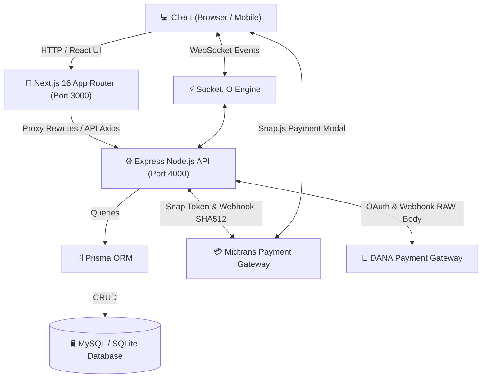

# 02. Arsitektur Sistem & Database ERD

[🏠 Home Utama](../README.md) \| [📚 Docs Hub](./README.md) \| [⬅️ Kembali: 01. Pendahuluan](./01-introduction.md) \| [Lanjut: 03. Setup & Instalasi ➡️](./03-setup-and-installation.md)

---

## 🏗️ Topologi Arsitektur Sistem

Aplikasi ini menggunakan arsitektur *decoupled client-server*. Frontend Next.js berfungsi sebagai lapisan antarmuka pengguna (UI), berkomunikasi dengan backend Express Node.js melalui endpoint REST HTTP dan saluran persistent Socket.IO WebSocket.



---

## 📂 Struktur Direktori Proyek

### Backend Structure (`backend/`)
```
backend/
├── prisma/
│   └── schema.prisma         # Model database Prisma & relasi
├── src/
│   ├── app.js                # Setup Express app, Security Headers, CORS, DANA Webhook, Rate Limiters
│   ├── server.js             # HTTP server & Socket.IO listener initialization
│   ├── controllers/          # Business logic handlers (Auth, Cart, Order, Payment, Product, User, Dana, etc.)
│   ├── lib/                  # Singletons (Prisma client, Midtrans snap, Socket.IO instance, env parser)
│   ├── middlewares/          # Security middlewares (Auth, Role check, Zod validation, Error handler, Rate limit)
│   ├── routes/               # Express router modules (auth, product, order, payment, cart, user, contact)
│   ├── services/             # Core service layers & database transactions
│   ├── tests/                # Jest automated test suites (52 test cases)
│   └── utils/                # Validators (Zod schemas) & helper utilities
└── uploads/                  # Storage gambar produk & user
```

### Frontend Structure (`frontend/`)
```
frontend/
├── app/                      # Next.js App Router routes & pages
│   ├── (admin)/              # Admin Dashboard layout & pages (/dashboard, /orders, /products, /users)
│   ├── cart/                 # Cart & checkout page (cart-and-checkout.tsx)
│   ├── login/ & register/    # Authentication pages
│   ├── orders/               # Customer order list & order tracking page ([id])
│   ├── products/             # Product catalog & product detail page ([id])
│   └── providers/            # AuthProvider & SocketProvider contexts
├── components/               # Reusable UI components (Navbar, Footer, Hero, Modals, Forms)
├── lib/                      # API client instance (Axios), helpers, Midtrans payment helper (`payment.ts`)
└── public/                   # Static branding assets
```

---

## 🛢️ Database ERD (Entity Relationship Diagram)

```mermaid
erDiagram
    USER ||--o{ ORDER : places
    USER ||--o{ CART : owns
    PRODUCT ||--o{ ORDER_ITEM : contained_in
    PRODUCT ||--o{ CART_ITEM : included_in
    ORDER ||--|{ ORDER_ITEM : contains
    CART ||--|{ CART_ITEM : contains

    USER {
        Int id PK
        String name
        String email UK
        String password
        String telephone
        String address
        String city
        String postalCode
        String image
        String role "default: customer"
        DateTime createdAt
        DateTime updatedAt
    }

    PRODUCT {
        Int id PK
        String name
        Int price
        Int stock
        String image
        String description
        DateTime createdAt
    }

    ORDER {
        Int id PK
        Int userId FK
        Int totalPrice
        Int shippingCost
        Int grandTotal
        String status "pending | paid | process | shipping | completed | canceled"
        String paymentMethod
        String courier
        String recipientName
        String telephone
        String address
        String city
        String postalCode
        String notes
        DateTime createdAt
        DateTime updatedAt
    }

    ORDER_ITEM {
        Int id PK
        Int orderId FK
        Int productId FK
        String productName
        Int price
        Int quantity
    }

    CART {
        Int id PK
        Int userId FK UK
        DateTime createdAt
        DateTime updatedAt
    }

    CART_ITEM {
        Int id PK
        Int cartId FK
        Int productId FK
        Int quantity
    }

    CONTACT_MESSAGE {
        Int id PK
        String name
        String email
        String subject
        String message
        DateTime createdAt
    }
```

---

[⬅️ Kembali: 01. Pendahuluan](./01-introduction.md) \| [📚 Docs Hub](./README.md) \| [Lanjut: 03. Setup & Instalasi ➡️](./03-setup-and-installation.md)
